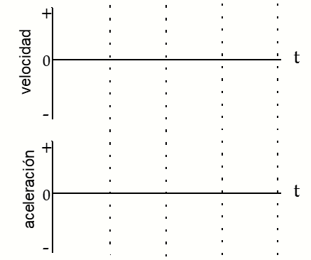

## **LibreLab (UNSL)**

Kit educativo de ciencia para experimentos en el aula, basado en Arduino.

# **Guía trabajo laboratorio universitario**

## **Actividad 1: El tren móvil**

---

**Demostración 1:** En la gráfica de velocidad vs tiempo de la izquierda abajo, dibuje su predicción de la gráfica que representaría a un tren alejándose del origen a una velocidad estable (constante). En los ejes posición-tiempo de la izquierda, represente su predicción de la gráfica posición vs tiempo para el mismo movimiento.

**Demostración 2:** En los dos sistemas de ejes de la derecha, realice la misma representación, pero para un movimiento de un tren acercándose al origen con una velocidad estable (constante).

---

**Demostración 3:** Dibuje en los ejes a la derecha sus predicciones de las gráficas velocidad-tiempo y aceleración-tiempo que representen el movimiento del tren alejándose del origen y aumentando su rapidez a un ritmo constante.

---

**Demostración 4:** Dibuje en los ejes a la derecha sus predicciones de las gráficas velocidad-tiempo y aceleración-tiempo que representen el movimiento del tren, alejándose del origen y disminuyendo su rapidez a un ritmo constante.

---

**Demostración 5:** Ahora el tren está bajo la acción de una fuerza constante que lo aleja del origen.  Dibuje sobre los ejes de la derecha su predicción de las gráficas de velocidad-tiempo y de aceleración-tiempo para un tren que, bajo la acción de esa fuerza, se mueve originalmente hacia el origen, disminuyendo su velocidad a un ritmo constante. 

---

**Demostración 6: **El tren está bajo la acción de una fuerza constante que lo aleja del origen. Dibuje sobre los ejes de la derecha su predicción de las gráficas de velocidad-tiempo y de aceleración-tiempo para un tren que, bajo la acción de esa fuerza, se mueve originalmente hacia el origen disminuyendo su velocidad a un ritmo constante hasta que se detiene por un instante, para luego comenzar a moverse alejándose del origen y aumentando paulatinamente su rapidez.

---

## **Actividad 2: La Rampa - Fuerza y movimiento**

**Demostración 7:** Dibuje su predicción de las gráficas velocidad –tiempo y aceleración - tiempo para un objeto que, después de recibir un empujón, se mueve hacia arriba de una rampa (alejándose del origen). Dibujar las gráficas que representen como disminuye su rapidez en la subida, se detiene un momento y luego comienza a moverse hacia abajo aumentando su rapidez y acercándose al origen.

Actividad 3: Tiro vertical
Demostración 8: Imagine que el origen del sistema de coordenadas está en el piso, con dirección vertical y sentido positivo hacia arriba.  Un objeto se arroja verticalmente hacia arriba, disminuye su velocidad hasta detenerse por un momento en el punto máximo de la trayectoria, para luego caer aumentando su rapidez.  Dibuje a la derecha su predicción para las gráficas velocidad-tiempo y aceleración-tiempo que representan el movimiento del objeto, desde un instante después que la arrojamos hacia arriba y hasta un momento antes de que llegue al piso.

