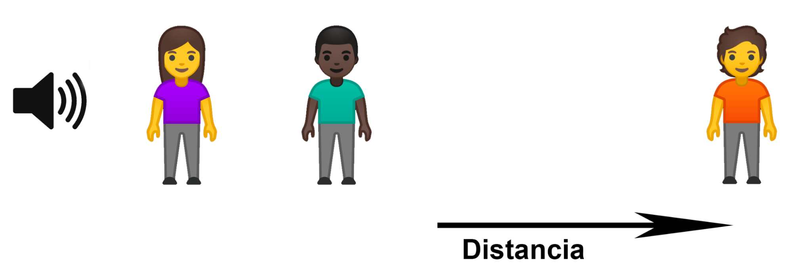
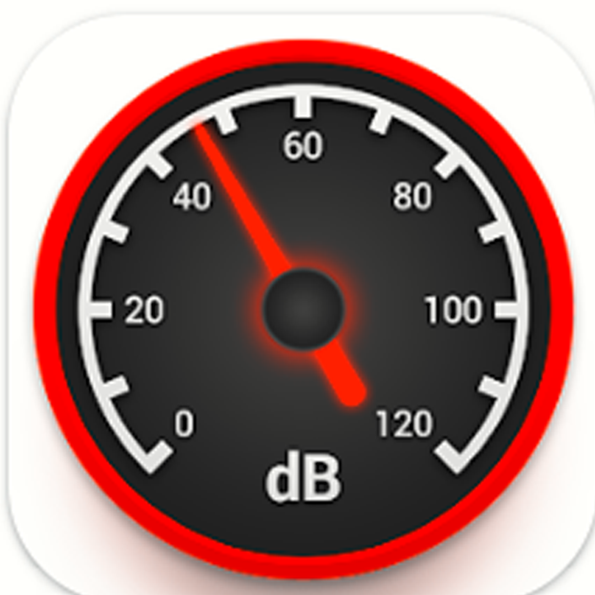

# Guía trabajo laboratorio escolar

## Velocidad del sonido

---

**Objetivo:** Realizar mediciones con el sensor ultrasónico, y obtener valores para la velocidad del sonido.

---

## Predicciones

**Pregunta Nº 1:** ¿Qué entendés por “velocidad del sonido”?

**Pregunta Nº 2:** Si estás en la calle, cerca de un parlante que reproduce música, ¿cómo cambia la intensidad del sonido, a medida que te vas alejando: **aumenta, disminuye o permanece igual?**

**Pregunta Nº 3:**  Si hay varias personas ubicadas a diferentes distancias del parlante, ¿Cómo cambia el valor de la velocidad del sonido, si esta tiene que llegar a cada persona? Escribí si la velocidad aumenta, disminuye, o permanece igual con la distancia.

 ---

## Experimentación

**Actividad 1: PLANIFICACIÓN** 

Trabaja en grupo y a partir de observar el funcionamiento del equipo experimental, propone un método para medir la velocidad del sonido.
Comparte con la clase la planificación propuesta.

**Actividad 2: EXPERIMENTACIÓN**

Lleva adelante la planificación propuesta, incluyendo las dificultades y los cambios que debiste realizar a partir de la planificación inicial.

---

**Actividad 3: CONCLUSIÓN**

Resume todo lo realizado a fin que alguien que no estuvo presente en el laboratorio entienda lo que se realizó. 

---

## PARTE II: (opcional)

Utilizando una aplicación de celular y una cinta métrica, registre la intensidad del sonido de un parlante con una onda sinusoidal, a distintas distancias en la siguiente tabla:

Podés usar la aplicación <a href="https://play.google.com/store/apps/details?id=com.splendapps.decibel"> **Sound Meter** 

| **Distancia** (centímetros) | **Intensidad del sonido** (decibeles) |
|------|------|
|      |      |
|      |      |
|      |      |
|      |      |

[⬅️ Volver](../VelSonido)
