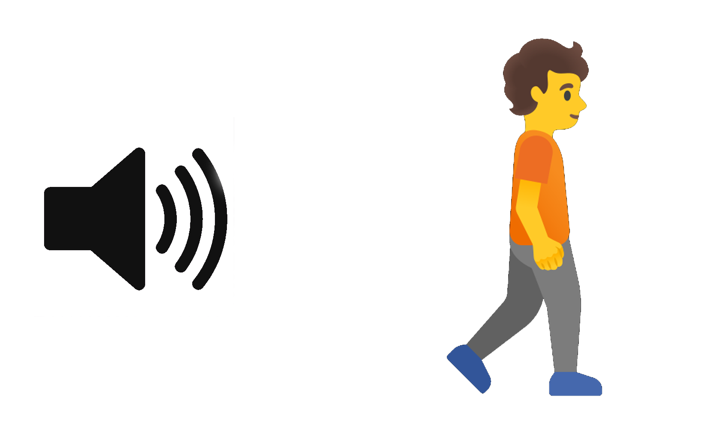

# Guía trabajo laboratorio escolar

## Velocidad del sonido

---

**Objetivo:** Realizar mediciones con el sensor ultrasónico, y obtener valores para la velocidad del sonido.

---

## Predicciones

**Pregunta Nº 1:** ¿Qué entendés por “velocidad del sonido”?

**Pregunta Nº 2:** Si estás en la calle, cerca de un parlante que reproduce música, ¿cómo cambia la intensidad del sonido, a medida que te vas alejando: **aumenta, disminuye o permanece igual?**

**Pregunta Nº 3:**  Si hay varias personas ubicadas a diferentes distancias del parlante, ¿Cómo cambia el valor de la velocidad del sonido, si esta tiene que llegar a cada persona? Escribí si la velocidad aumenta, disminuye, o permanece igual con la distancia.

 ---

## Experimentación

**Actividad 1:** 

Luego de familiarizarse con el sensor, mida la distancia del mismo a la ubicación del objetivo y complete la siguiente tabla realizando las mediciones que correspondan. Más tarde, haga los cálculos correspondientes para encontrar la velocidad del sonido en cada caso.

| **Distancia** (metros) | **Tiempo de vuelo** (segundos) | **Tiempo (Tiempo de vuelo / 2)** (segundos) | **Velocidad del sonido** (m/s) |
|------|------|------|------|
|      |      |      |      |
|      |      |      |      |
|      |      |      |      |
|      |      |      |      |

**Actividad 2:**

 Según los datos obtenidos, ¿cómo se compara la velocidad del sonido obtenida en cada medición?

---

## Conclusión

La velocidad del sonido es: (calcule su valor promedio)

---

## PARTE II: (opcional)

Utilizando una aplicación de celular y una cinta métrica, registre la intensidad del sonido de un parlante con una onda sinusoidal, a distintas distancias en la siguiente tabla:

Podés usar la aplicación <a href="https://play.google.com/store/apps/details?id=com.splendapps.decibel"> **Sound Meter** 

| **Distancia** (centímetros) | **Intensidad del sonido** (decibeles) |
|------|------|
|      |      |
|      |      |
|      |      |
|      |      |

---

# 6. Bibliografía

1. **Manual de Entrenamiento AAMe 9 Módulo 1: Introducción** \
Julio Benegas (Universidad Nacional de San Luis, Argentina), David R. Sokoloff (University of Oregon, USA)
