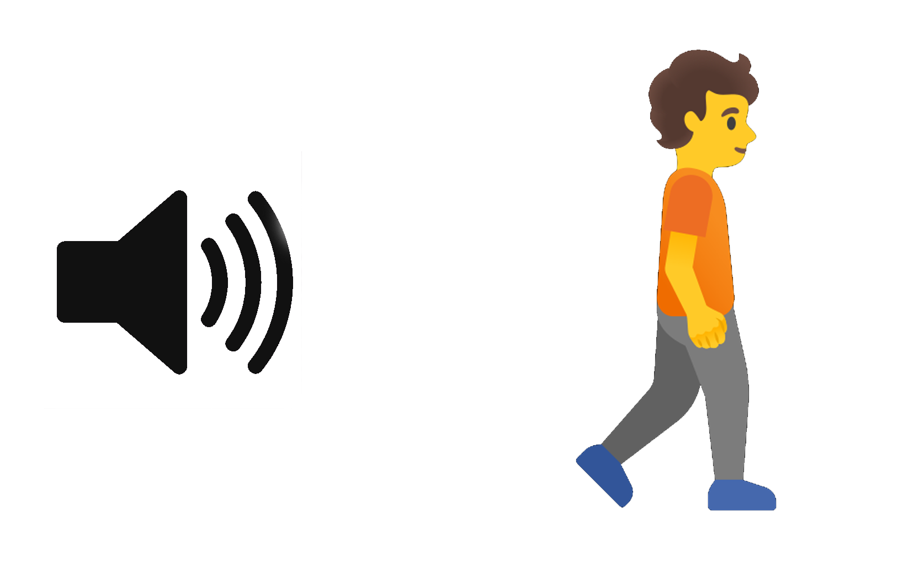
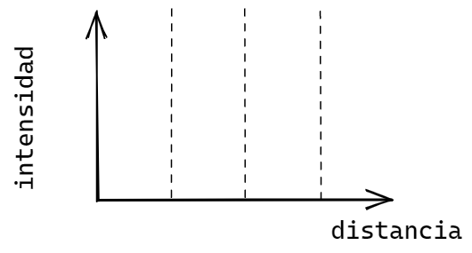
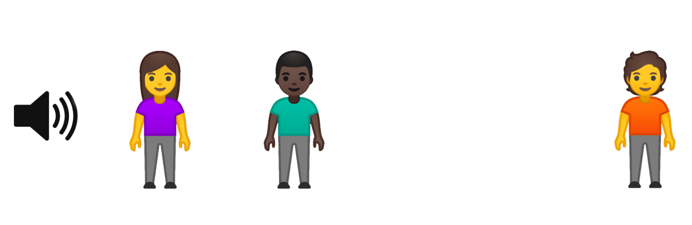
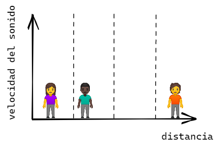

# Guía trabajo laboratorio universitario

## Velocidad del sonido

---

**Objetivo:** Realizar mediciones con el sensor ultrasónico, y obtener valores para la velocidad del sonido. Graficar y obtener el valor del ajuste lineal.

Basándonos en los valores de error del sensor y la distancia, hacer propagación de errores para obtener el error en la medición de la velocidad del sonido.

---

## Predicciones

**Pregunta Nº 1:** ¿Qué entendés por “velocidad del sonido”?

**Pregunta Nº 2:** Si estás en la calle, cerca de un parlante que reproduce música, ¿cómo cambia la intensidad del sonido, a medida que te vas alejando: **aumenta, disminuye o permanece igual?**

Dibuja una línea que represente cualitativamente el valor de la intensidad del sonido a medida que nos alejamos.

**Pregunta Nº 2:**  Si hay varias personas ubicadas a diferentes distancias del parlante, ¿cómo cambia el valor de la velocidad del sonido, si esta tiene que llegar a cada persona?

Dibuje una línea que represente la velocidad del sonido para la distancia recorrida para cada persona.

**Pregunta Nº 3: **¿La velocidad del sonido es independiente de la temperatura?

**Actividad 1:** 

1. Luego de familiarizarse con el sensor, mida la distancia del mismo a la ubicación del objetivo y complete la siguiente tabla realizando las mediciones que correspondan. Más tarde, haga los cálculos correspondientes para encontrar la velocidad del sonido en cada caso.

| **Distancia** (metros) | **Tiempo de vuelo** (segundos) | **Tiempo (Tiempo de vuelo / 2)** (segundos) | **Velocidad del sonido** (m/s) |
|------|------|------|------|
|      |      |      |      |
|      |      |      |      |
|      |      |      |      |
|      |      |      |      |

En caso de tener un software de graficación (Excel, OriginLab), realice una gráfica de los puntos **distancia vs tiempo de vuelo/2**, y haga un ajuste lineal para obtener el valor ajustado para la velocidad del sonido.

**Actividad 2:**

 Según los datos obtenidos, ¿cómo se compara la velocidad del sonido obtenida en cada medición?

¿Cómo se compara el promedio de valores de la tabla, con el valor obtenido del ajuste lineal?

**Actividad 3:**

Teniendo en cuenta que el sensor tiene un error de 1 mm, y el error en la regla de medición usada para medir la distancia, haga la propagación de errores para obtener el error total en el valor de la velocidad del sonido.

## Conclusión

La velocidad del sonido estimada es: (calcule su valor promedio y su error, en metros por segundo)

Explique por qué la velocidad del sonido (permanece o no) constante para diferentes distancias de recorrido.

[⬅️ Volver](../VelSonido)
