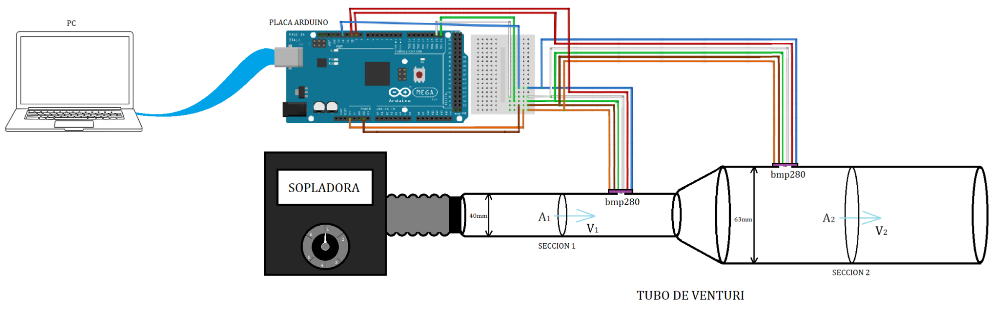
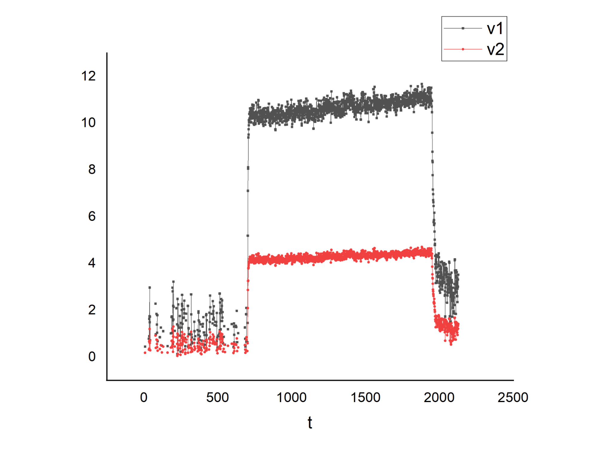
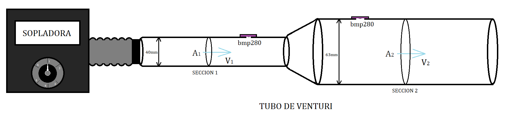

**Guía del docente:**

La experiencia esta preparado para ser ejecutada por los alumnos de forma grupal.

## Objetivos

* Visualizar el Efecto Venturi.

**Antes de que los alumnos realicen la actividad 2:**

* Conectar la sopladora a la sección 1 del tubo de venturi como se ve en la imagen
* Conectar la placa Arduino a la pc mediante la conexión USB (cable azul).
* En el “Manual del usuario del software LibreLab” se detalla el método para comenzar la obtención de datos y visualizar las gráficas de presión y velocidad.

**Actividad 2:**

* Encender la sopladora
* Mostrar a los alumnos que la presión y la velocidad tardan unos segundos en llegar al estado estacionario (cuando los valores de presión y velocidad se mantienen constantes).
* Notar que efectivamente la velocidad aumenta y la presión decrece al disminuir el área. 

    

    Figura 1: Equipo armado.

En la figura 2 se ve una gráfica de los valores que deberían observarse para la presión en la sección 1 y la sección 2 del tubo de Venturi en el tiempo. Se ve claramente que inicialmente las presiones son iguales y una vez que corre aire por el tubo ambas bajan, siendo mayor el la caída de la presión en la sección 1 .

La figura 3 es un gráfico de las velocidades del aire en ambas secciones del tubo La velocidad en la sección 1 es mayor que en la sección 2.

Con estos resultados se comprueba el efecto venturi y dado que la velocidad es mayor en la sección donde el área transversal es menor y la velocidad del fluido es mayor comparadas con las magnitudes medidas en la sección 2.

Tener en cuenta que los valores de las presiones varían según la velocidad del fluido así que aunque se aprecie el efecto venturi, serán distintos si se usa una sopladora diferente que produzca otro caudal de aire.

	Figura 2: Gráfica de P vs t para las dos secciones del tubo de Venturi.

	Figura 3: Gráfica de velocidad vs t para las dos secciones del tubo de Venturi.

**Guia para los alumnos:**

## Objetivos

* Visualizar el Efecto Venturi.

**Actividad 1: **

**PREDICCIÓN:**

Observe el tubo de Venturi con la sopladora que le mostrara el instructor y responda:

1. ¿Cómo se compara el área de la sección transversal en el tubo donde está la sopladora con el área en el tubo de la derecha?
2. Considerando que el caudal eyectado por la sopladora es constante y no hay fuentes ni sumideros, ¿Cómo crees que será la velocidad del fluido en la sección más estrecha comparada con la velocidad en la sección más ancha?
3. Si tapamos la salida de aire en el extremo del tubo, ¿qué crees que sucederá con la presión en su interior? ¿Aumenta, disminuye o se mantiene constante?
4. ¿Cómo crees que será la presión en el interior del tubo en la sección más estrecha comparada con la presión en la sección más ancha?

**Actividad 2:**

**EXPERIMENTACIÓN:**

Ahora su instructor encenderá la sopladora e iniciará el registro de datos obtenidos con cada sensor. A partir de lo que observa:

1. ¿Cómo se compara la presión en la sección 1 con la presión en la sección 2?
2. ¿Cómo se compara la velocidad en la sección 1 con la velocidad en la sección 2?

**Conclusiones: **

Con base en sus observaciones de la experiencia realizada, complete:

En un fluido ideal, si el caudal que circula por una tubería es constante (ya que no hay pérdidas ni fuentes adicionales) se cumple que:

Cuando el área aumenta, la presión __________________________.

Cuando la presión aumenta, la velocidad ______________________.

Cuando el área aumenta, la velocidad ________________________.
