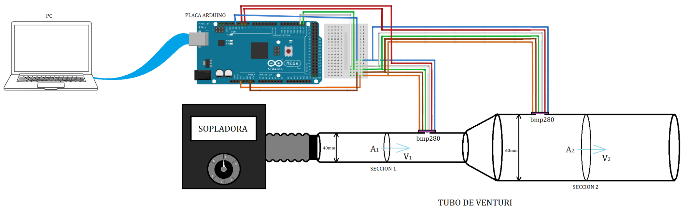
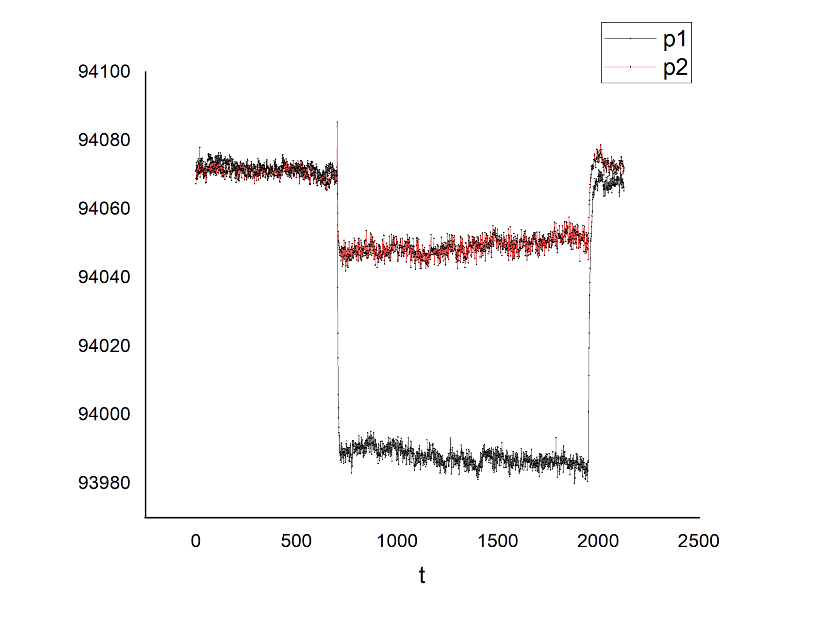
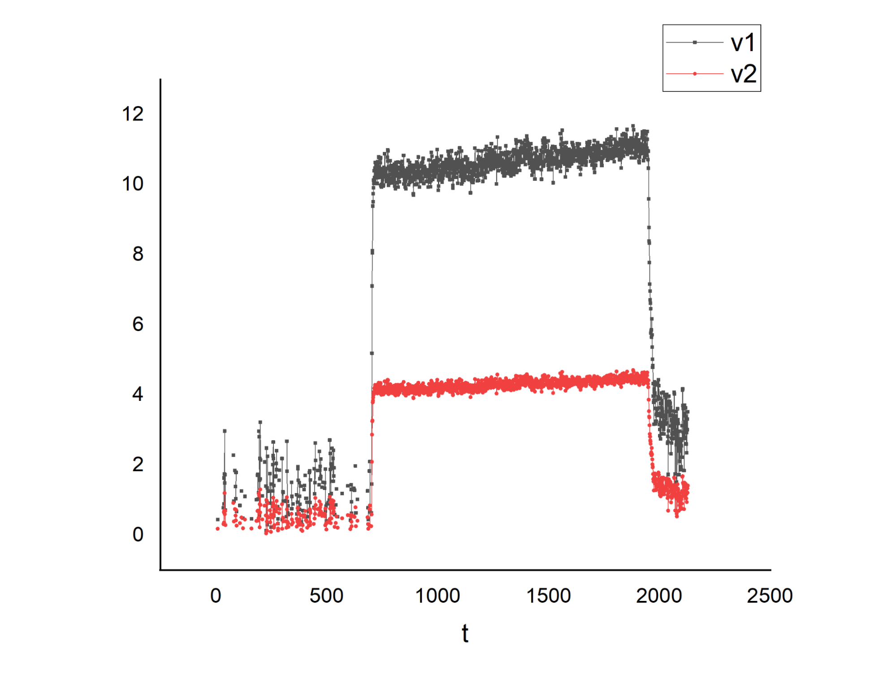

**Guía del docente:**

La experiencia esta preparada para ser ejecutada por los alumnos de forma grupal.

## Objetivos

* Visualizar el Efecto Venturi.
* Aplicar la Ecuación de Bernoulli y el Principio de Continuidad.
* Determinar el caudal de fluido que circula por un conducto.

**Materiales:**

* Tubo de Venturi

* Calibre

* Computadora con programa LibreLab

* Kit de medición LibreLab

_Opcional:_

* Cronómetro

* Piñata

**Antes de que los alumnos realicen la actividad 2:**

* Conectar la sopladora a la sección 1 del tubo de venturi como se ve en la imagen
* Conectar la placa Arduino a la pc mediante la conexión USB (cable azul).
* En el “Manual del usuario del software LibreLab” se detalla el método para comenzar la obtención de datos, visualizar las gráficas de presión y velocidad y la posterior exportación de datos.

**Actividad 2:**

* Encender la sopladora
* Mostrar a los alumnos que la presión y la velocidad tardan unos segundos en llegar al estado estacionario (cuando los valores de presión y velocidad se mantienen constantes).
* Notar que efectivamente la velocidad aumenta y la presión decrece al disminuir el área. 
* Una vez obtenida una cantidad suficiente de datos exportarlos para su uso en algún programa que permita el análisis de datos (Excel, OriginLab, etc.).

    

    Figura 1: Equipo armado.

En la figura 2 se ve una gráfica de los valores que deberían observarse para la presión en la sección 1 y la sección 2 del tubo de Venturi en el tiempo. Se ve claramente que inicialmente las presiones son iguales y una vez que corre aire por el tubo ambas bajan, siendo mayor el la caída de la presión en la sección 1 .

La figura 3 es un gráfico de las velocidades del aire en ambas secciones del tubo La velocidad en la sección 1 es mayor que en la sección 2.

Con estos resultados se comprueba el efecto venturi y dado que la velocidad es mayor en la sección donde el área transversal es menor y la velocidad del fluido es mayor comparadas con las magnitudes medidas en la sección 2.

Tener en cuenta que los valores de las presiones varían según la velocidad del fluido así que aunque se aprecie el efecto venturi, serán distintos si se usa una sopladora diferente que produzca otro caudal de aire.

	Figura 2: Gráfica de P vs t para las dos secciones del tubo de Venturi.

	Figura 3: Gráfica de velocidad vs t para las dos secciones del tubo de Venturi.

    

## Guía para los alumnos:

## Objetivos

* Visualizar el Efecto Venturi.
* Aplicar la Ecuación de Bernoulli y el Principio de Continuidad.
* Determinar el caudal de fluido que circula por un conducto.

**Materiales:**

* Tubo de Venturi

* Calibre

* Computadora con programa LibreLab

* Kit de medición LibreLab

_Opcional:_

* Cronómetro

* Piñata

**Actividad 1:**

**PREDICCIÓN:**

Observe el tubo de Venturi con la sopladora que le mostrara el instructor y responda:

1. Considerando un fluido ideal de caudal constante, ¿Cómo crees que será la velocidad del fluido en la sección más estrecha comparada con la velocidad en la sección más ancha?
2. Si se obstruye la salida de aire en el extremo del tubo, ¿Qué pensás que sucederá con la presión en su interior? ¿Aumenta, disminuye o se mantiene constante?
3. ¿Cómo considerás que será la presión en el interior del tubo en la sección más estrecha, comparada con la presión en la sección más ancha?

**Actividad 2:**

**EXPERIMENTACIÓN:**

Ahora se encenderá la sopladora y se iniciará el registro de datos obtenidos con cada sensor. Espere a que se llegue al estado estacionario y a partir de los datos obtenidos argumente:

1. ¿Cómo se compara la presión en la sección 1 con la presión en la sección 2?
2. Determine la diferencia media de presión entre la sección 1 y la sección 2.
3. Mida el diámetro interno de ambas secciones del tubo y calcule sus áreas transversales correspondientes.
4. Habiendo obtenido la diferencia de presión y las áreas, utilice la Ecuación de Bernoulli y el Principio de Continuidad para determinar las velocidades en la sección 1 y en la sección 2. ¿En qué difieren?
5. Calcule el caudal de aire que circula por el tubo.

**Conclusiones:**

Con base en sus observaciones de la experiencia realizada, complete:

En un fluido ideal, si el caudal que circula por una tubería es constante, se cumple que:

Al disminuir el área del conducto, la velocidad  ___________________.

El aumento de velocidad hace que la presión del fluido _____________.

La caída de presión es debida a un _____ del área transversal del tubo.

**_Actividad Opcional: Determinación del caudal de salida de la sopladora_**

1. Usando un cronómetro mida el tiempo necesario para inflar una piñata con la sopladora.
2. Suponiendo que la piñata es esférica determine el volumen de aire contenido.
3. Con estos datos, calcule el caudal de salida de la Sopladora.
4. El caudal medido en la sección 1 es diferente al caudal de salida de la sopladora, ¿A qué cree que se debe esta diferencia?
