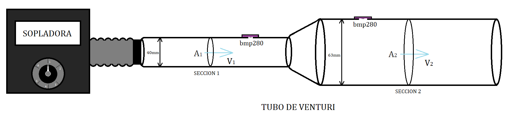

## Objetivos

* Visualizar el Efecto Venturi.
* Aplicar la Ecuación de Bernoulli y el Principio de Continuidad.
* Determinar el caudal de fluido que circula por un conducto.

**Materiales:**

* Tubo de Venturi

* Calibre

* Computadora con programa LibreLab

* Kit de medición LibreLab

_Opcional:_

* Cronómetro

* Piñata

**Actividad 1:**

**PREDICCIÓN:**

Observe el tubo de Venturi con la sopladora que le mostrara el instructor y responda:

1. Considerando un fluido ideal de caudal constante, ¿Cómo crees que será la velocidad del fluido en la sección más estrecha comparada con la velocidad en la sección más ancha? ¿Qué te hace decir esto?
2. Si se obstruye la salida de aire en el extremo del tubo, ¿Qué pensás que sucederá con la presión en su interior? ¿Aumenta, disminuye o se mantiene constante? Explicita tu razonamiento
3. ¿Cómo considerás que será la presión en el interior del tubo en la sección más estrecha, comparada con la presión en la sección más ancha?

**Actividad 2: TRABAJO CON UN COMPAÑERO**
Compara tus respuestas con un compañero. ¿Han encontrado diferencias? ¿Cuáles?

**Actividad 3: PLANIFIFACIÓN**
Con un compañero, a partir de lo observado del funcionamiento del equipo ¿Cómo cree que podría corroborar las preguntas contestadas en la Actividad 1? ¿Qué datos puede obtener directamente?

¿Qué necesita medir si quiere saber la velocidad del flujo en cada sección?

Realice un plan de acción para obtener las mediciones de velocidad, incluyendo las ecuaciones que podría utilizar

**Actividad 4: EXPERIMENTACIÓN:**

Luego de la revisión con la clase de la planificación lleve adelante el experimento, tomando nota de las dificultades y de los posibles cambios realizados a partir de su planificación inicial

**Actividad 5: Conclusiones:**

Resume todo lo realizado a fin que alguien que no estuvo presente en el laboratorio entienda lo que se realizó. ¿A qué relación llegas entre caudal, velocidad y presión? ¿Cómo puede explicarlo?
